# EnjoyTrip_DB_서울_11_최효빈_이강희
https://www.youtube.com/watch?v=Zujd17yREBY
# 팀원 소개

| 팀원   |
| ------ |
| 최효빈 |
| 이강희 |

# 1. 요구사항 구현 목록  

| 순번 | 요구사항명               | 요구사항 상세 |
| :--: | :----------------------: | :-----------: | 
|  F01  | 지역별 관광지 정보 수집   |   한국관광공사 : 지역별 관광지 정보를 얻어와 화면에 표시    | 
|    F02  |관광지, 숙박, 음식점 조회    |  관광지 정보를 지역별 원하는컨텐츠 별 조회    | 
|   F03  | 문화시설, 공연, 여행코스, 쇼핑조회                |   관광지 정보를 지역별 원하는 컨텐츠 별 조회     | 
|   F04  | 회원 관리        |    회원가입, 비밀번호 수정, 회원 정보 조회, 탈퇴     |  
|  F05  | 로그인 관리   |    로그인 / 로그아웃 / 비밀번호 찾기     | 
|  F06  | 게시판 등록   |    게시판 등록/수정/삭제/조회    | 
|  F07  | 나만의 여행 계획 관리  |      여행 계획 추가/삭제/수정/조회  |  

# 2. 다이어그램
## 2.1. ER Diagram 
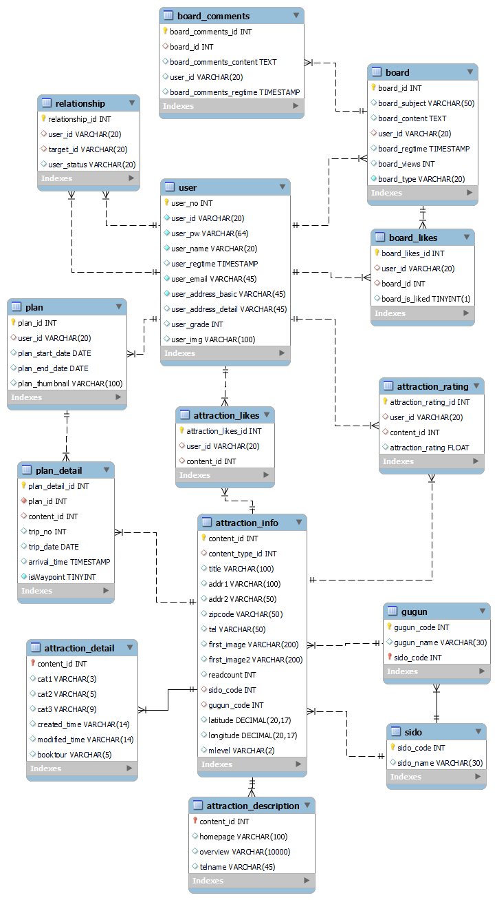

 

# 3. 기능 구현 시연

## 3.1. 메인 페이지 및 메뉴 구성

## 3.2. 관광지 정보 조회

## 3.3. 회원관리 (로그인, 로그아웃, 마이페이지)

## 3.4. 사이트맵 / 전체적인 메뉴 구성

## 3.5. 게시판 (여행정보 공유, 공지사항)

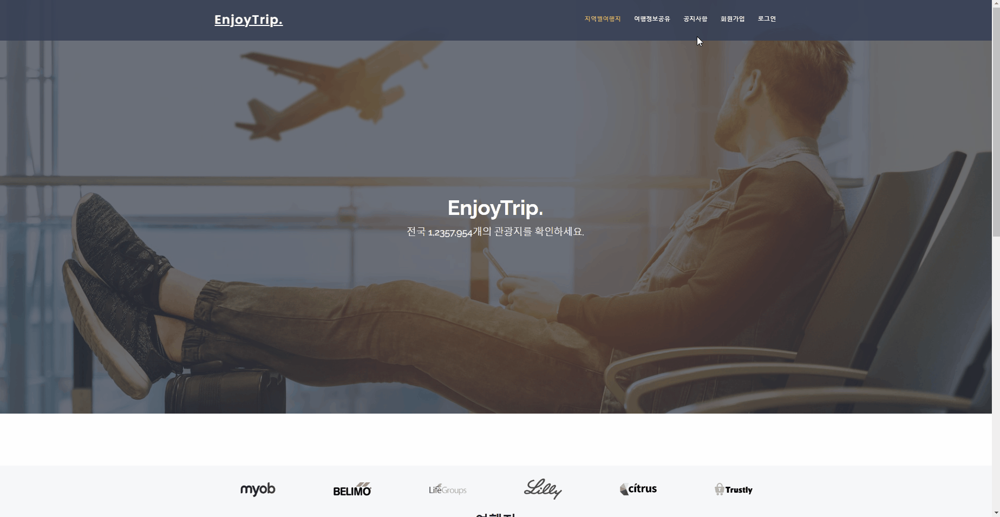

 

# 4. REST 데이터 시연

## 4.1. 관광지 정보 (get)
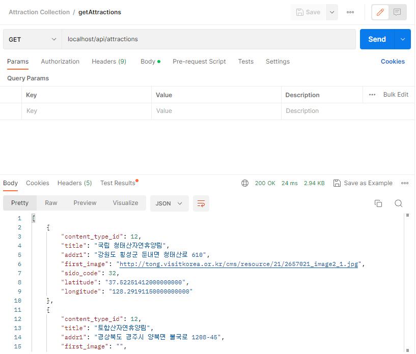

## 4.2. 사용자 (get, post)
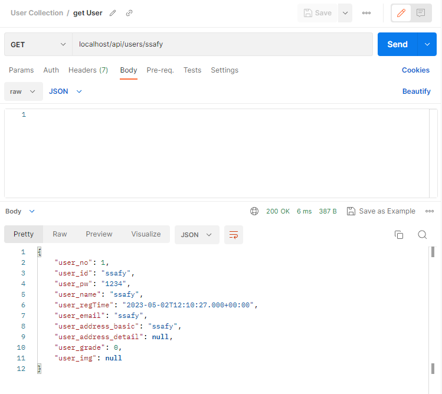

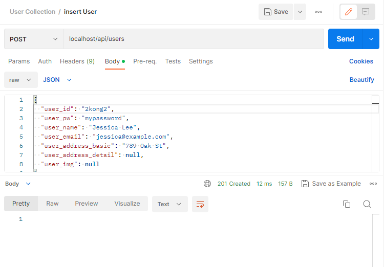

## 4.3. 게시판 (get, post)
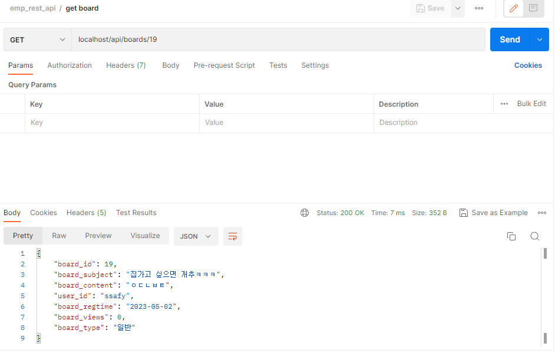

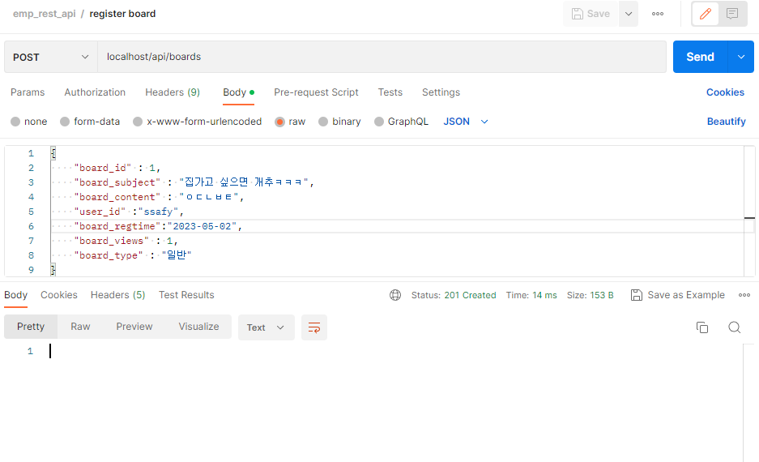

## 4.4. 여행계획 (get, post)

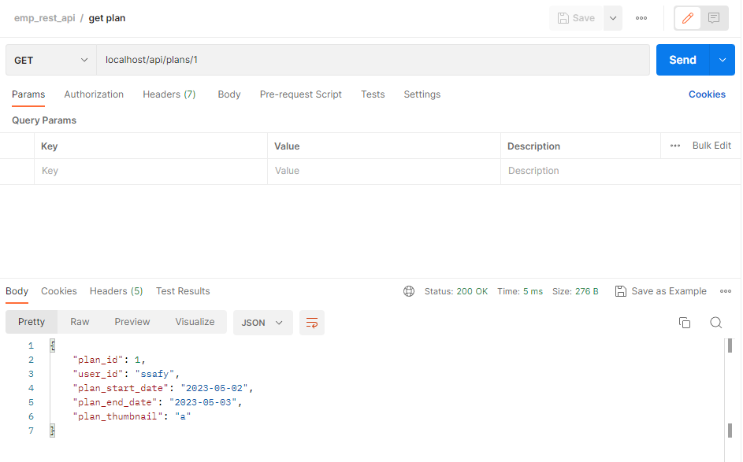

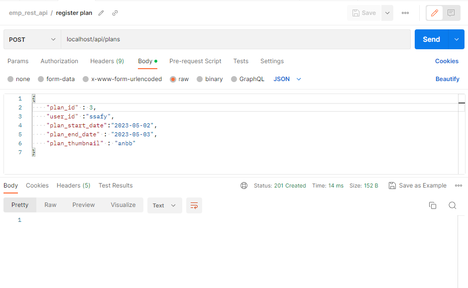

## 4.5. 여행계획 상세보기 (get, post)

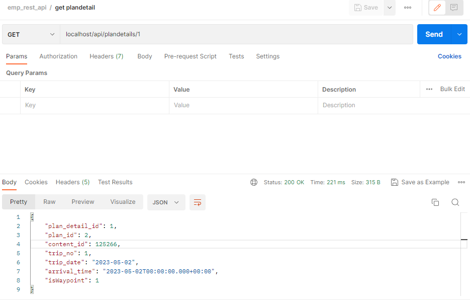

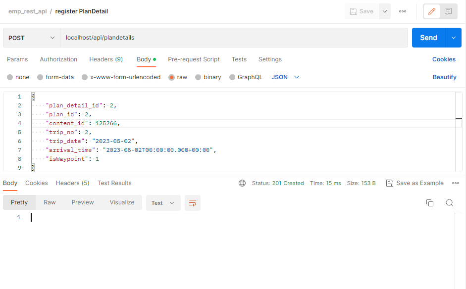

## 4.6. 관광지 좋아요 표시 (post, get)

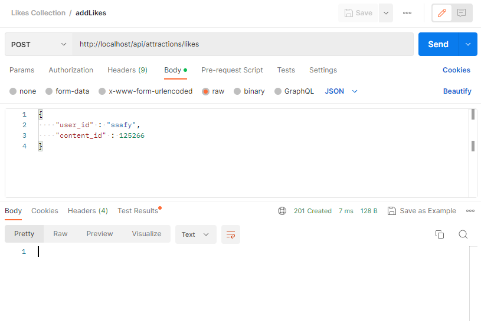

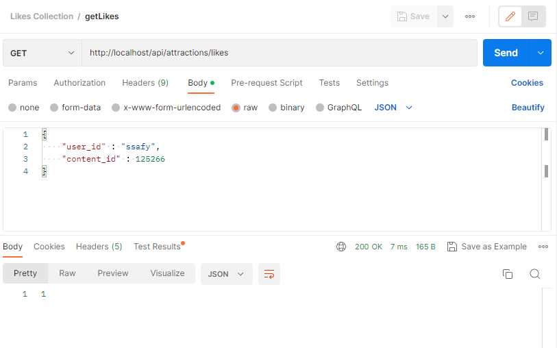

## 4.7. 관광지 평점 부여 (get, put)

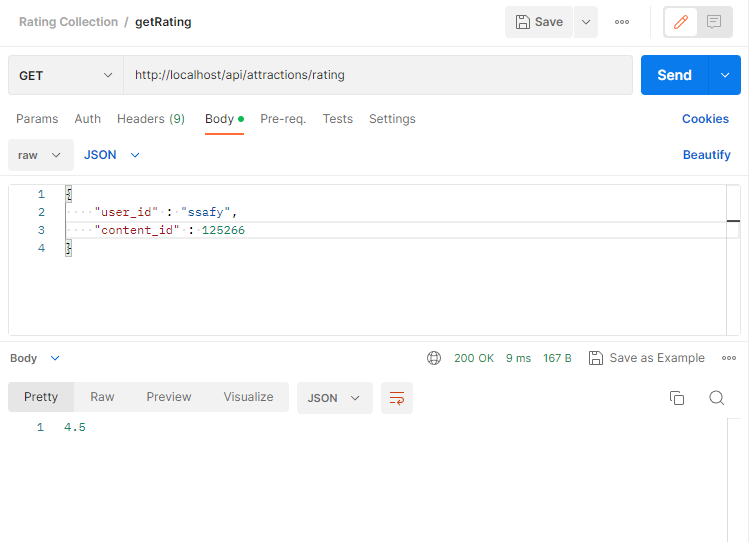

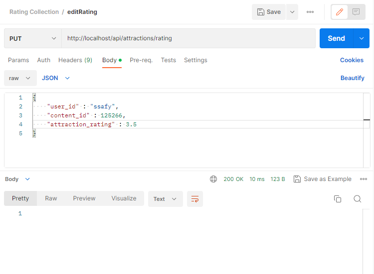

  
